## The objective: to predict the Age of Abalone Species for harvesting

### Statistical Inference & Model Creation

_(Regression)_. Supervised Learning. What we want to do is __Predict Values, i.e Age__. Making forecasts, not estimating the relationship between values.


# __Abalone__

_Raw Data_

<table class="table table-striped table-hover" style="margin-left: auto; margin-right: auto;">
<caption>Abalone Raw Data</caption>
 <thead>
  <tr>
   <th style="text-align:left;"> Variable </th>
   <th style="text-align:left;"> Classes </th>
   <th style="text-align:left;"> Glimpse </th>
  </tr>
 </thead>
<tbody>
  <tr>
   <td style="text-align:left;"> Sex </td>
   <td style="text-align:left;"> integer </td>
   <td style="text-align:left;"> Infant, Infant, Infant, Infant, Infant, Infant </td>
  </tr>
  <tr>
   <td style="text-align:left;"> Length </td>
   <td style="text-align:left;"> double </td>
   <td style="text-align:left;"> 5.565, 3.675, 10.08, 4.095, 6.93, 7.875 </td>
  </tr>
  <tr>
   <td style="text-align:left;"> Diam </td>
   <td style="text-align:left;"> double </td>
   <td style="text-align:left;"> 4.095, 2.625, 7.35, 3.15, 4.83, 6.09 </td>
  </tr>
  <tr>
   <td style="text-align:left;"> Height </td>
   <td style="text-align:left;"> double </td>
   <td style="text-align:left;"> 1.26, 0.84, 2.205, 0.945, 1.785, 2.1 </td>
  </tr>
  <tr>
   <td style="text-align:left;"> Whole </td>
   <td style="text-align:left;"> double </td>
   <td style="text-align:left;"> 11.5, 3.5, 79.375, 4.6875, 21.1875, 27.375 </td>
  </tr>
  <tr>
   <td style="text-align:left;"> Shuck </td>
   <td style="text-align:left;"> double </td>
   <td style="text-align:left;"> 4.3125, 1.1875, 44, 2.25, 9.875, 11.5625 </td>
  </tr>
  <tr>
   <td style="text-align:left;"> Rings </td>
   <td style="text-align:left;"> integer </td>
   <td style="text-align:left;"> 6, 4, 6, 3, 6, 6 </td>
  </tr>
  <tr>
   <td style="text-align:left;"> Class </td>
   <td style="text-align:left;"> character </td>
   <td style="text-align:left;"> A1, A1, A1, A1, A1, A1 </td>
  </tr>
  <tr>
   <td style="text-align:left;"> Volume </td>
   <td style="text-align:left;"> double </td>
   <td style="text-align:left;"> 28.7137305, 8.103375, 163.36404, 12.18979125, 59.7473415, 100.713375 </td>
  </tr>
  <tr>
   <td style="text-align:left;"> Ratio </td>
   <td style="text-align:left;"> double </td>
   <td style="text-align:left;"> 0.150189471, 0.146543878, 0.26933712, 0.184580683, 0.16527932, 0.114806003 </td>
  </tr>
</tbody>
</table>

-----

## 1.) __Ratio__

### a.) Kurtosis

+ Forming a histogram and QQ plot using __RATIO__. 
+ Calculating skewness and kurtosis using '__rockchalk__.' 

Be aware that with 'rockchalk', the kurtosis value has 3.0 subtracted from it which differs from the 'moments' package.

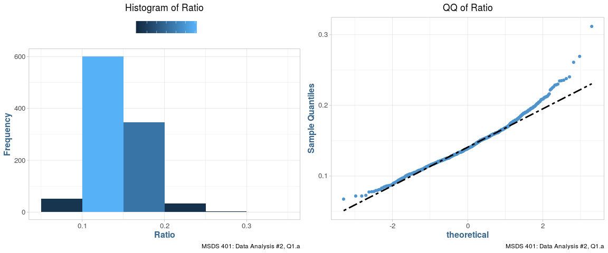<!-- -->
---------------------
 Kurtosis   Skewness 
---------- ----------
  1.667      0.7147  
---------------------

### b.) Log Scale

+ Transforming RATIO using *log10()* to create L_RATIO. 
+ Forming a histogram and QQ plot using __L_RATIO__. 
+ Calculating the skewness and kurtosis. 
+ Creating a boxplot of __L_RATIO__ differentiated by __CLASS__.

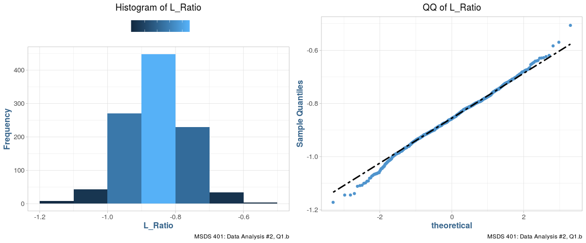<!-- -->


---------------------
 Kurtosis   Skewness 
---------- ----------
  0.5354    -0.09392 
---------------------

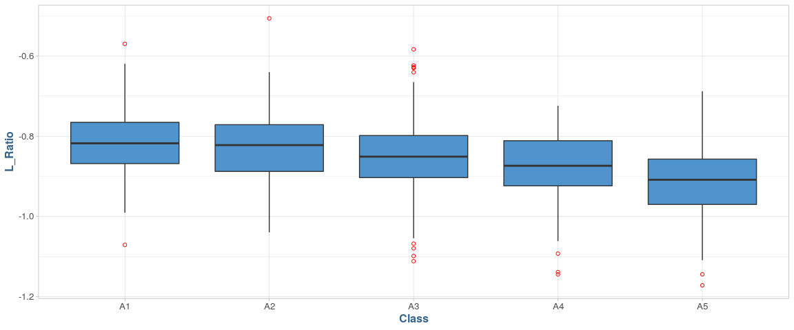<!-- -->

### c.) Bartlett's Test

+ Testing the homogeneity of variance across Age Classes using *bartlett.test()*

_(Variance)_. of a distribution is a measure of the variability of data. It measures how far a set of (random) numbers are spread out from their average value. It can be formulated as the average of the squared difference from the mean.

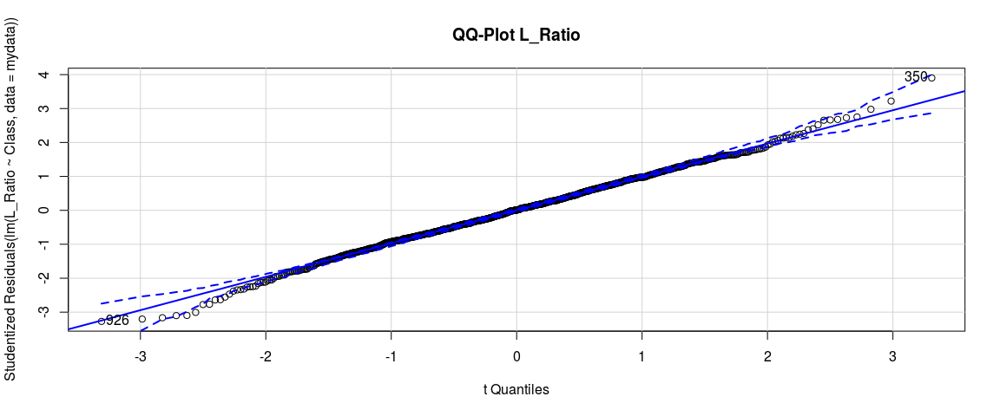<!-- -->

```
[1] 350 926
```

```

	Bartlett test of homogeneity of variances

data:  L_Ratio by Class
Bartlett's K-squared = 3.1891, df = 4, p-value = 0.5267
```


--------------------
      P_Value       
--------------------
 Cannot Reject Null 
--------------------

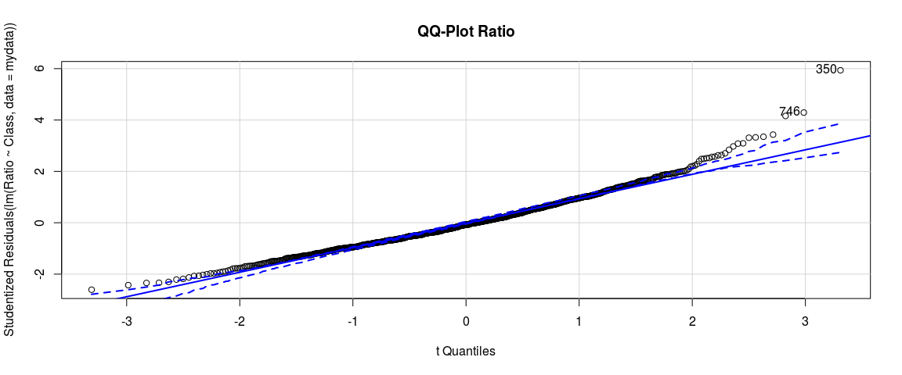<!-- -->

```
[1] 350 746
```

```

	Bartlett test of homogeneity of variances

data:  Ratio by Class
Bartlett's K-squared = 21.49, df = 4, p-value = 0.0002531
```


-------------
   P_Value   
-------------
 Reject Null 
-------------

__Question:__ 

+ Based on steps 1.a, 1.b and 1.c, which variable RATIO or L_RATIO exhibits better conformance to a normal distribution with homogeneous variances across Age Classes?  
 
__Answer:__

>__L_Ratio__ exhibits better conformance to normality across Age Classes due to the QQ-Plots falling closer in-line with the expected quantiles, lower Kurtosis, as well as having a less skewed distribution as observed by both the skewness measure and the histograms of the respective variables. Finally, at 0.05 a significance level, we cannot reject the null hypothesis that L_Ratio comes from a normal distribution according to Bartlett's test for Equality of Variances, which we must do for ratio analysis as it falls well short of significance.

-----

## 2.) __Analysis of Variance__

### a.) ANOVA

+ Performing an analysis of variance with *aov()* on L_RATIO using CLASS and SEX as the independent variables. 
+ Assuming equal variances. 
+ Performing 2 analyses. 
+ First, fitting a model _with_ the interaction term __CLASS:SEX__. 
+ Then, fitting a model _without_ __CLASS:SEX__. 
+ Using *summary()* to obtain the Analysis of Variance tables.

<table class="table table-striped table-hover" style="margin-left: auto; margin-right: auto;">
<caption>L_Ratio ~ Class * Sex</caption>
 <thead>
  <tr>
   <th style="text-align:left;"> Variable </th>
   <th style="text-align:right;"> Df </th>
   <th style="text-align:right;"> Sum Sq </th>
   <th style="text-align:right;"> Mean Sq </th>
   <th style="text-align:right;"> F value </th>
   <th style="text-align:right;"> Pr(&gt;F) </th>
  </tr>
 </thead>
<tbody>
  <tr>
   <td style="text-align:left;"> Class </td>
   <td style="text-align:right;"> 4 </td>
   <td style="text-align:right;"> 1.0554 </td>
   <td style="text-align:right;"> 0.2638 </td>
   <td style="text-align:right;"> 38.3699 </td>
   <td style="text-align:right;"> 0.0000 </td>
  </tr>
  <tr>
   <td style="text-align:left;"> Sex </td>
   <td style="text-align:right;"> 2 </td>
   <td style="text-align:right;"> 0.0914 </td>
   <td style="text-align:right;"> 0.0457 </td>
   <td style="text-align:right;"> 6.6444 </td>
   <td style="text-align:right;"> 0.0014 </td>
  </tr>
  <tr>
   <td style="text-align:left;"> Class:Sex </td>
   <td style="text-align:right;"> 8 </td>
   <td style="text-align:right;"> 0.0267 </td>
   <td style="text-align:right;"> 0.0033 </td>
   <td style="text-align:right;"> 0.4855 </td>
   <td style="text-align:right;"> 0.8671 </td>
  </tr>
  <tr>
   <td style="text-align:left;"> Residuals </td>
   <td style="text-align:right;"> 1021 </td>
   <td style="text-align:right;"> 7.0206 </td>
   <td style="text-align:right;"> 0.0069 </td>
   <td style="text-align:right;"> NA </td>
   <td style="text-align:right;"> NA </td>
  </tr>
</tbody>
</table>

<table class="table table-striped table-hover" style="margin-left: auto; margin-right: auto;">
<caption>L_Ratio ~ Class + Sex</caption>
 <thead>
  <tr>
   <th style="text-align:left;"> Variable </th>
   <th style="text-align:right;"> Df </th>
   <th style="text-align:right;"> Sum Sq </th>
   <th style="text-align:right;"> Mean Sq </th>
   <th style="text-align:right;"> F value </th>
   <th style="text-align:right;"> Pr(&gt;F) </th>
  </tr>
 </thead>
<tbody>
  <tr>
   <td style="text-align:left;"> Class </td>
   <td style="text-align:right;"> 4 </td>
   <td style="text-align:right;"> 1.0554 </td>
   <td style="text-align:right;"> 0.2638 </td>
   <td style="text-align:right;"> 38.524 </td>
   <td style="text-align:right;"> 0.0000 </td>
  </tr>
  <tr>
   <td style="text-align:left;"> Sex </td>
   <td style="text-align:right;"> 2 </td>
   <td style="text-align:right;"> 0.0914 </td>
   <td style="text-align:right;"> 0.0457 </td>
   <td style="text-align:right;"> 6.671 </td>
   <td style="text-align:right;"> 0.0013 </td>
  </tr>
  <tr>
   <td style="text-align:left;"> Residuals </td>
   <td style="text-align:right;"> 1029 </td>
   <td style="text-align:right;"> 7.0473 </td>
   <td style="text-align:right;"> 0.0068 </td>
   <td style="text-align:right;"> NA </td>
   <td style="text-align:right;"> NA </td>
  </tr>
</tbody>
</table>

__Question:__

+ Comparing the 2 analyses.
+ What does the non-significant interaction term suggest about the relationship between __L_RATIO__ and the attributes __CLASS__ and __SEX__?

__Answer:__

>It means the joint effect of Class and Sex is not statistically higher than the sum of both effect individually.

### b.) Tukey

+ For the model without __CLASS:SEX__ (i.e. an interaction term), obtaining multiple comparisons with the *TukeyHSD()* function. 
+ Interpreting the results at the 95% confidence level (*TukeyHSD()* will adjust for unequal sample sizes). 

<table class="table table-striped table-hover" style="margin-left: auto; margin-right: auto;">
<caption>Tukey Class</caption>
 <thead>
  <tr>
   <th style="text-align:left;">   </th>
   <th style="text-align:right;"> diff </th>
   <th style="text-align:right;"> lwr </th>
   <th style="text-align:right;"> upr </th>
   <th style="text-align:right;"> p adj </th>
  </tr>
 </thead>
<tbody>
  <tr>
   <td style="text-align:left;"> A2-A1 </td>
   <td style="text-align:right;"> -0.012 </td>
   <td style="text-align:right;"> -0.039 </td>
   <td style="text-align:right;"> 0.014 </td>
   <td style="text-align:right;"> 0.692 </td>
  </tr>
  <tr>
   <td style="text-align:left;"> A3-A1 </td>
   <td style="text-align:right;"> -0.034 </td>
   <td style="text-align:right;"> -0.059 </td>
   <td style="text-align:right;"> -0.009 </td>
   <td style="text-align:right;"> 0.002 </td>
  </tr>
  <tr>
   <td style="text-align:left;"> A4-A1 </td>
   <td style="text-align:right;"> -0.059 </td>
   <td style="text-align:right;"> -0.086 </td>
   <td style="text-align:right;"> -0.031 </td>
   <td style="text-align:right;"> 0.000 </td>
  </tr>
  <tr>
   <td style="text-align:left;"> A5-A1 </td>
   <td style="text-align:right;"> -0.100 </td>
   <td style="text-align:right;"> -0.128 </td>
   <td style="text-align:right;"> -0.072 </td>
   <td style="text-align:right;"> 0.000 </td>
  </tr>
  <tr>
   <td style="text-align:left;"> A3-A2 </td>
   <td style="text-align:right;"> -0.022 </td>
   <td style="text-align:right;"> -0.041 </td>
   <td style="text-align:right;"> -0.002 </td>
   <td style="text-align:right;"> 0.018 </td>
  </tr>
  <tr>
   <td style="text-align:left;"> A4-A2 </td>
   <td style="text-align:right;"> -0.046 </td>
   <td style="text-align:right;"> -0.068 </td>
   <td style="text-align:right;"> -0.024 </td>
   <td style="text-align:right;"> 0.000 </td>
  </tr>
  <tr>
   <td style="text-align:left;"> A5-A2 </td>
   <td style="text-align:right;"> -0.087 </td>
   <td style="text-align:right;"> -0.110 </td>
   <td style="text-align:right;"> -0.065 </td>
   <td style="text-align:right;"> 0.000 </td>
  </tr>
  <tr>
   <td style="text-align:left;"> A4-A3 </td>
   <td style="text-align:right;"> -0.024 </td>
   <td style="text-align:right;"> -0.045 </td>
   <td style="text-align:right;"> -0.004 </td>
   <td style="text-align:right;"> 0.011 </td>
  </tr>
  <tr>
   <td style="text-align:left;"> A5-A3 </td>
   <td style="text-align:right;"> -0.066 </td>
   <td style="text-align:right;"> -0.087 </td>
   <td style="text-align:right;"> -0.045 </td>
   <td style="text-align:right;"> 0.000 </td>
  </tr>
  <tr>
   <td style="text-align:left;"> A5-A4 </td>
   <td style="text-align:right;"> -0.041 </td>
   <td style="text-align:right;"> -0.065 </td>
   <td style="text-align:right;"> -0.018 </td>
   <td style="text-align:right;"> 0.000 </td>
  </tr>
</tbody>
</table>

<table class="table table-striped table-hover" style="margin-left: auto; margin-right: auto;">
<caption>Tukey Sex</caption>
 <thead>
  <tr>
   <th style="text-align:left;">   </th>
   <th style="text-align:right;"> diff </th>
   <th style="text-align:right;"> lwr </th>
   <th style="text-align:right;"> upr </th>
   <th style="text-align:right;"> p adj </th>
  </tr>
 </thead>
<tbody>
  <tr>
   <td style="text-align:left;"> Female-Infant </td>
   <td style="text-align:right;"> 0.016 </td>
   <td style="text-align:right;"> 0.001 </td>
   <td style="text-align:right;"> 0.031 </td>
   <td style="text-align:right;"> 0.038 </td>
  </tr>
  <tr>
   <td style="text-align:left;"> Male-Infant </td>
   <td style="text-align:right;"> 0.018 </td>
   <td style="text-align:right;"> 0.003 </td>
   <td style="text-align:right;"> 0.033 </td>
   <td style="text-align:right;"> 0.011 </td>
  </tr>
  <tr>
   <td style="text-align:left;"> Male-Female </td>
   <td style="text-align:right;"> 0.002 </td>
   <td style="text-align:right;"> -0.013 </td>
   <td style="text-align:right;"> 0.017 </td>
   <td style="text-align:right;"> 0.941 </td>
  </tr>
</tbody>
</table>

__Question:__

+ First, interpret the trend in coefficients across Age Classes. 
+ What is this indicating about __L_RATIO__?
+ Second, do these results suggest Male and Female abalone can be combined into a single category labeled as 'adult?' 
+ If not, why not?

__Answer:__

>The trends in Age Class is interesting in that for the Age Classes A3, A4 and A5 the L_Ratio values are not significantly significant (at a 95% level) from each other meaning that there is no relationship to L_Ratio and Age Classes A3, A4 and A5.
<br/><br/>
However, for the A1 and A2 classes there is a clear relationship between the Age Class and the value of L_Ratio.
<br/><br/>
Secondly, Male and Female abalone have a 0.941 similarity in means, suggesting they're well beyond statistically significant, almost to the point of being identical. It would be logical to just combine them and split the abalone into Infant and Adult for ratio analysis.

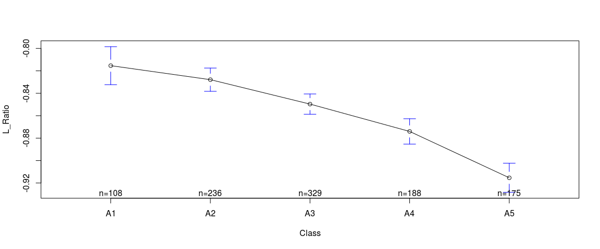<!-- -->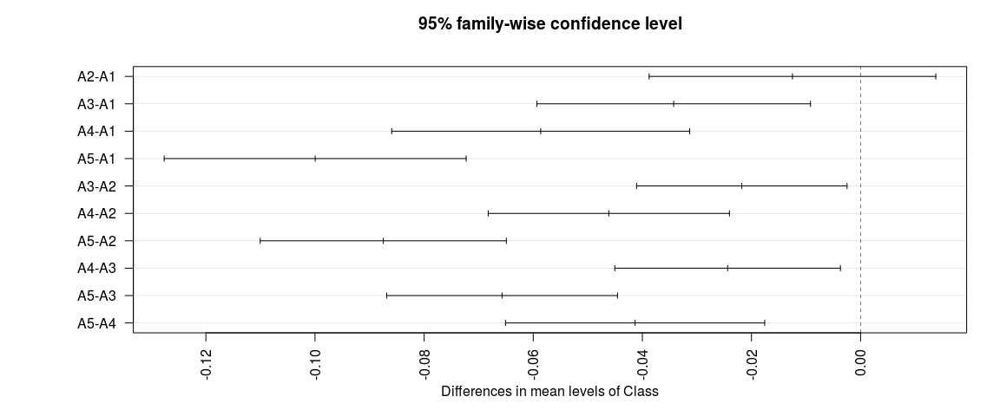<!-- -->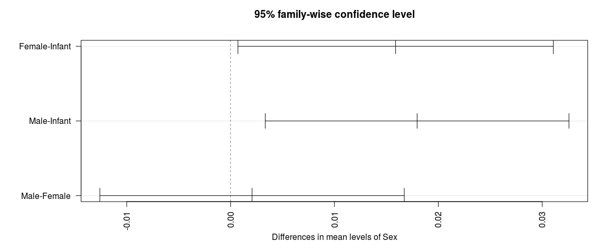<!-- -->

-----

## 3.) __Infant/Adult__

### a.) Type

+ Using *combineLevels()* from the 'rockchalk' package to combine "M" and "F" into a new level, "__ADULT__". This will necessitate defining a new variable, __TYPE__, in mydata which will have 2 levels:  "__INFANT__" and "__ADULT__". 
+ Presenting side-by-side histograms of VOLUME. 
+ Displaying infant Volumes and, the other, Adult Volumes. 

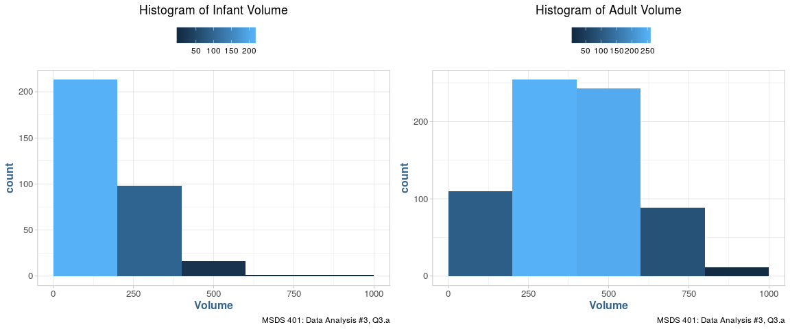<!-- -->

__Question:__

+ Compare the histograms.
+ How do the distributions differ? 
+ Are there going to be any difficulties separating Infant from Adult based on __VOLUME__?

__Answer:__

>The 2 distributions have distinct shapes, however, there is a significant amount of overlap in the 0 - 500 range. Abalone having a VOLUME > 500, I could assume with relative safety would be Adult, however, there are significant amounts of both Infant and Adult abalone in the lower range. 
<br/><br/>
Around 90% of Infant abalone have a Volume measure that's less than the lower 50% of Adult abalone, giving us reason to be concerned about overlap here.


-----------------------
 Adult.50%   Adult.75% 
----------- -----------
   388.7       530.4   
-----------------------


-----------------------
 Adult.50%   Adult.90% 
----------- -----------
   148.5       331.1   
-----------------------

### b.) Shuck ~ Volume

+ Creating a scatterplot of __SHUCK__ vs. __VOLUME__ and a scatterplot of their base ten logarithms, labeling the variables as __L_SHUCK__ and __L_VOLUME__. 
+ Be aware the variables, __L_SHUCK__ and __L_VOLUME__, present the data as orders of magnitude (i.e. VOLUME = 100 = 10^2 becomes L_VOLUME = 2). 
+ Using color to differentiate __CLASS__ in the plots. 
+ Repeat using color to differentiate by __TYPE__. 

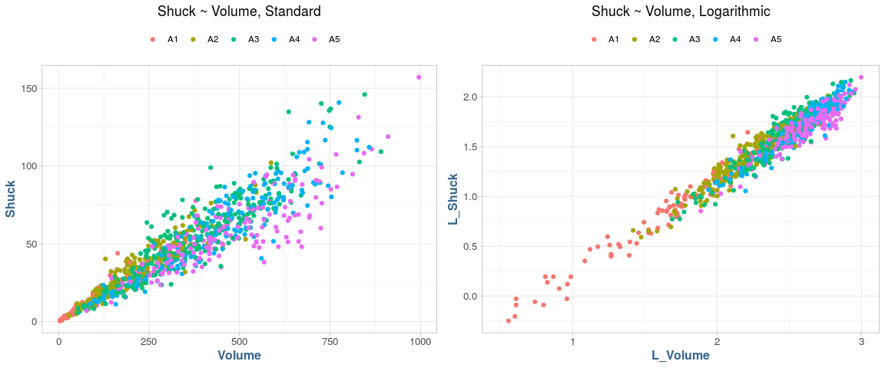<!-- --><!-- -->

__Question: __

Comparing the 2 scatterplots.

+ What effect(s) does log-transformation appear to have on the variability present in the plot?  
+ What are the implications for linear regression analysis? 
+ Where do the various CLASS levels appear in the plots? 
+ Where do the levels of TYPE appear in the plots?

__Answer__:

>There is a reduction of variability of the logarithmic transformed Volume variable which gives clearer separation between the Sex and Age in the distribution. The logarithmic version is considerably more suited for linear regression analysis. The Sex variable is particularly well distributed with a visible cutoff of the majority of Infants that lie below 2 on the logarithmic scale.
<br/><br/>
Logarithmic version of Class variable also shows better conformity to a linear model, however, the top 3 Age classes, A3, A4 and A5 still exhibit a considerable amount of clustering at the right end of the scale.


----------------------
   Ratio     L_Ratio  
----------- ----------
 0.0008599   0.007917 
----------------------

-----

## 4.) __Age Class__

### a.) Linear Regression

+ Since abalone growth slows after Age Class __A3__, Infants in Classes __A4 and A5__ are considered mature and candidates for harvest. 
+ Reclassifying the Infants in Classes __A4 and A5__ as _ADULT_.
+ This reclassification can be achieved using *combineLevels()*, but only on the abalone in classes __A4 and A5__. 
+ I will use this recoded TYPE variable, in which the Infants in Age Classes __A4__ and __A5__ are reclassified as _ADULT_, for the remainder of this data analysis.
+ Regress __L_SHUCK__ as the dependent variable on __L_VOLUME__, __CLASS__ and __TYPE__. 
+ Using the multiple regression model: __L_SHUCK ~ L_VOLUME + CLASS + TYPE__. 
+ Applying *summary()* to the model object to produce results.

<br />


  * **Model**: L_Shuck ~ L_Volume + Class + Type

<!-- end of list -->


---------------------------------------------------------
  Min.     1st Qu.     Median    Mean   3rd Qu.    Max.  
--------- ---------- ---------- ------ --------- --------
 -0.2706   -0.05429   0.000159    0     0.05599   0.3097 
---------------------------------------------------------

<table class="table table-striped table-hover" style="margin-left: auto; margin-right: auto;">
<caption>Coefficients</caption>
 <thead>
  <tr>
   <th style="text-align:left;"> Variable </th>
   <th style="text-align:right;"> Estimate </th>
   <th style="text-align:right;"> Std. Error </th>
   <th style="text-align:right;"> t value </th>
   <th style="text-align:right;"> Pr(&gt;|t|) </th>
  </tr>
 </thead>
<tbody>
  <tr>
   <td style="text-align:left;"> (Intercept) </td>
   <td style="text-align:right;"> -0.81751 </td>
   <td style="text-align:right;"> 0.01904 </td>
   <td style="text-align:right;"> -42.93573 </td>
   <td style="text-align:right;"> 0.00000 </td>
  </tr>
  <tr>
   <td style="text-align:left;"> L_Volume </td>
   <td style="text-align:right;"> 0.99930 </td>
   <td style="text-align:right;"> 0.01026 </td>
   <td style="text-align:right;"> 97.37662 </td>
   <td style="text-align:right;"> 0.00000 </td>
  </tr>
  <tr>
   <td style="text-align:left;"> ClassA2 </td>
   <td style="text-align:right;"> -0.01801 </td>
   <td style="text-align:right;"> 0.01100 </td>
   <td style="text-align:right;"> -1.63610 </td>
   <td style="text-align:right;"> 0.10212 </td>
  </tr>
  <tr>
   <td style="text-align:left;"> ClassA3 </td>
   <td style="text-align:right;"> -0.04731 </td>
   <td style="text-align:right;"> 0.01247 </td>
   <td style="text-align:right;"> -3.79282 </td>
   <td style="text-align:right;"> 0.00016 </td>
  </tr>
  <tr>
   <td style="text-align:left;"> ClassA4 </td>
   <td style="text-align:right;"> -0.07578 </td>
   <td style="text-align:right;"> 0.01406 </td>
   <td style="text-align:right;"> -5.39142 </td>
   <td style="text-align:right;"> 0.00000 </td>
  </tr>
  <tr>
   <td style="text-align:left;"> ClassA5 </td>
   <td style="text-align:right;"> -0.11712 </td>
   <td style="text-align:right;"> 0.01413 </td>
   <td style="text-align:right;"> -8.28816 </td>
   <td style="text-align:right;"> 0.00000 </td>
  </tr>
  <tr>
   <td style="text-align:left;"> TypeAdult </td>
   <td style="text-align:right;"> 0.02109 </td>
   <td style="text-align:right;"> 0.00769 </td>
   <td style="text-align:right;"> 2.74373 </td>
   <td style="text-align:right;"> 0.00618 </td>
  </tr>
</tbody>
</table>


---------------------------------------------------------
 Residual_Std_Error   dof    Multiple_RSq   Adjusted_Rsq 
-------------------- ------ -------------- --------------
      0.08297         1029      0.9504         0.9501    
---------------------------------------------------------


------------------------------------------------------
 F_Stat.value   F_Stat.numdf   F_Stat.dendf   p-value 
-------------- -------------- -------------- ---------
     3287            6             1029          0    
------------------------------------------------------
    
__Question:__

+ Interpret the trend in __CLASS__ level coefficient estimates? 

_(Hint:  this question is not asking if the estimates are statistically significant. 
It is asking for an interpretation of the pattern in these coefficients, and how this pattern relates to the earlier displays)_

__Answer:__

>The Age Class level coefficients show a clear increasing trend in the Class variable with respect to L_Shuck. Given the intercept is negative (meaning the expected value of Shuck would be negative given a value of 0 for our predictors), this means that we would expect to add an increasingly large negative number as the Classes go from A3 -> A5 (A2 is arguably not statically significant from A1, at a 10% level, while A3, A4 and A5 are), meaning that as the Class level variable increases, I would also expect L_Shuck to increase. This is the pattern I also see in the displays.

__Question:__ 

+ Is __TYPE__ an important predictor in this regression model? 

_(Hint:  this question is not asking if TYPE is statistically significant, but rather how it compares to the other independent variables in terms of its contribution to predictions of L_SHUCK for harvesting decisions)_

__Answer:__

>Type is also an important predictor in determining WHEN to harvest abalone. The TypeAdult variable tells us that we can expect to add 0.02 to the Shuck variable when the Type is Adult, meaning that in general Adult abalone are larger in Shuck and Volume than Infant abalone, which is consistent with our display in __3b__.

-----

The next 2 analysis step into an analysis of the residuals resulting from the regression model in __(4)(a)__.

-----

## 5.) __Residual Analysis__

### a.) Normality

+ As "model" is the regression object, using model$residuals constructing a histogram and QQ plot. 
+ Computing the skewness and kurtosis. 
+ Be aware that with 'rockchalk,' the kurtosis value has 3.0 subtracted from it which differs from the 'moments' package. 

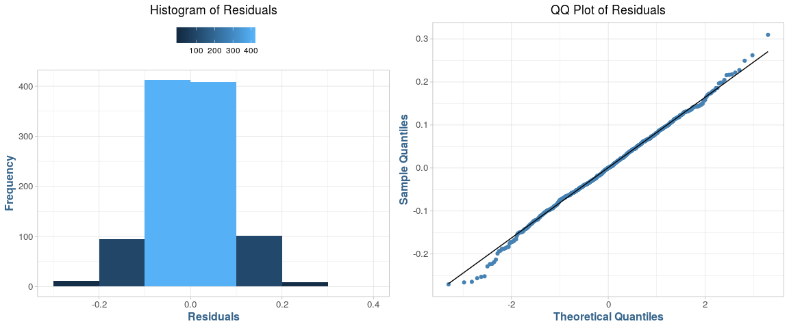<!-- -->
---------------------
 Kurtosis   Skewness 
---------- ----------
  0.3433    -0.05945 
---------------------

### b.) Variance

+ Plotting the residuals versus __L_VOLUME__, coloring the data points by __CLASS__ and, a second time, coloring the data points by __TYPE__. 
+ Keeping in mind the y-axis and x-axis may be disproportionate which will amplify the variability in the residuals. 
+ Presenting boxplots of the residuals differentiated by __CLASS__ and __TYPE__ (These 4 plots can be conveniently presented on one page using *par(mfrow..)* or *grid.arrange()*. 
+ Testing the homogeneity of variance of the residuals across Age Classes using *bartlett.test().*  

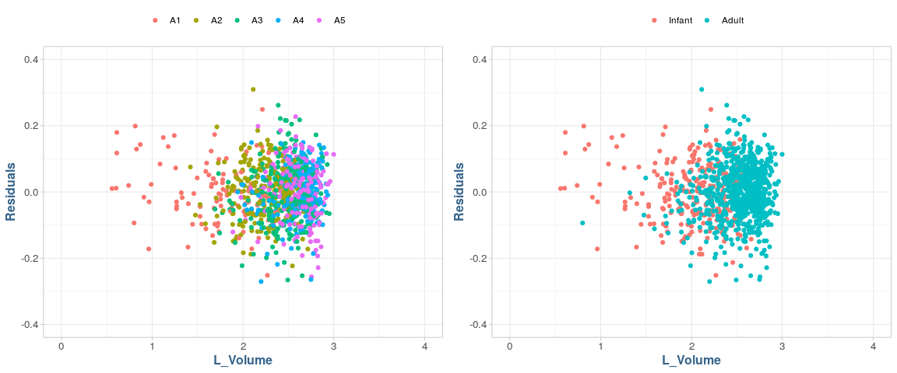<!-- -->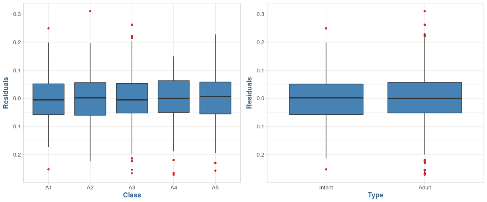<!-- -->

```

	Bartlett test of homogeneity of variances

data:  Residuals by Class
Bartlett's K-squared = 3.6882, df = 4, p-value = 0.4498
```

__Question:__  

+ What is revealed by the displays and calculations in __(5)(a)__ and __(5)(b)__? 
+ Does the model 'fit'?  
+ Does this analysis indicate that __L_VOLUME__, and ultimately __VOLUME__, might be useful for harvesting decisions? 
+ __Discuss.__

__Answer:__

>The plots in __(5)(a)__ show a reasonably symmetric histogram and QQ plot, although there are a few outliers in the residuals, prominently distinguishable in the QQ-Plot. 
<br/><br/>
The histogram shows a great deal of clustering in the middle, however, also looking at the Kurtosis and Skewness of the residuals, I see they are approximately zero indicating a relatively normal behavior indicating our model is relatively well fit for the data and that it may ultimately prove useful in determining when to harvest abalone. 
<br/><br/>
The Bartlett test performed on Age Class indicates that the variance amongst the Age Classes don't differ significantly __(p = 0.45)__, although the presence of several outliers is an area of concern.

-----

__There is a trade-off faced in managing abalone harvest__. The Infant population must be protected since it represents future harvests. On the other hand, the harvest should be designed to be efficient with a yield to justify the effort. This task will use VOLUME to form binary decision rules to guide harvesting. 

If VOLUME is below a "cutoff" (i.e. a specified volume), that individual will not be harvested. If above, it will be harvested. Different rules are possible.

The next steps in the analysis will require consideration of the proportions of Infants and Adults harvested at different cutoffs. 

+ For this, similar "for-loops" will be used to compute the harvest proportions. These loops must use the same values for the constants min.v and delta and use the same statement "for(k in 1:10000)." 
+ Otherwise, the resulting Infant and Adult proportions cannot be directly compared and plotted as requested.

-----

## 6.) __Optimal Harvesting__

### a.) Split Values

A series of volumes covers the range from minimum to maximum abalone volume will be used in a "for loop" to determine how the harvest proportions change as the "cutoff" changes. 


----------------------------
 Infant Split   Adult Split 
-------------- -------------
    133.8          384.5    
----------------------------

### b.) Split Visual

Presenting a plot showing the Infant proportions and the Adult proportions vs. volume.value. Computing the 50% "split" volume.value for each and showing it in a plot.   

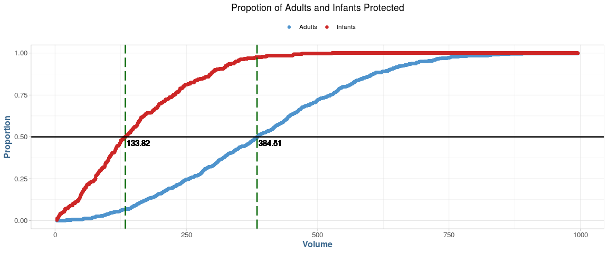<!-- -->

__Question:__

The two 50% "split" values serve a descriptive purpose illustrating the difference between the populations. 

+ What do these values suggest regarding possible cutoffs for harvesting?

__Answer:__

>From the information displayed, it would suggest that Infants will be harvested at a disproportional rate than Adult abalone based on the determined volume cutoff. 
<br/><br/>
The slope of the Infant line is much steeper and reaches the cutoff point relatively quickly, meaning we have a high likelihood of harvesting a disproportion amount of Infants leading to an overall less than optimal harvest yield.

-----

This part will address the determination of a volume.value corresponding to the observed maximum difference in harvest percentages of Adults and Infants.

To calculate this result, the vectors of proportions from item __(6)__ must be used. 

These proportions must be converted from "not harvested" to "harvested" proportions by using *(1 - prop.infants)* for Infants, and *(1 - prop.adults)* for Adults.

The reason the proportion for Infants drops sooner than Adults is that Infants are maturing and becoming Adults with larger volumes.

-----

## 7.) __Harvest Proportions__

### a.) Difference

+ Evaluating a plot of the difference *((1 - prop.adults) - (1 - prop.infants))* vs. volume.value. 
+ Comparing to the 50% "split" points determined in __(6)(a)__. 
+ There is considerable variability present in the peak area for this plot. 
+ The observed "peak" difference may not be the best representation of the data. 
+ One solution is to smooth the data to determine a more representative estimate of the maximum difference.

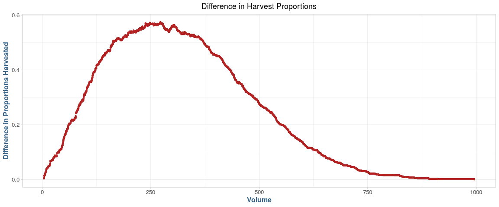<!-- -->

### b.) Smoothed

+ Executing the following to create a smoothed curve to append to the plot in __(a)__. 
+ The procedure is to individually smooth (1-prop.adults) and (1-prop.infants) before determining an estimate of the maximum difference. 

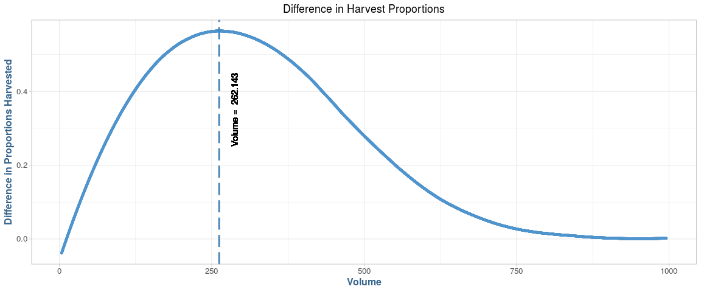<!-- -->

### c.) Combined

+ Presenting a plot of the difference *((1 - prop.adults) - (1 - prop.infants))* vs. volume.value with the variable smooth.difference superimposed. 
+ Determining the volume.value corresponding to the maximum smoothed difference. 
+ Showing the estimated peak location corresponding to the cutoff determined.

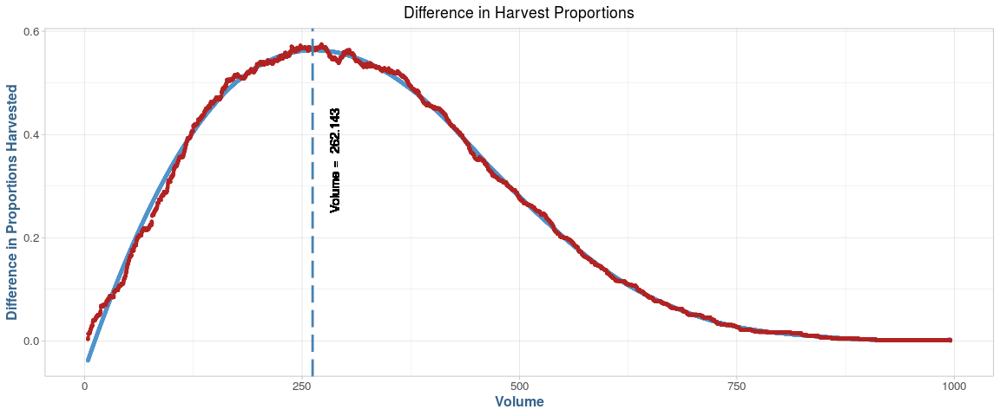<!-- -->

### d.) Cutoff

+ What separate harvest proportions for Infants and Adults would result if this cutoff is used? 
+ Showing the separate harvest proportions (NOTE: the Adult harvest proportion is the __"true positive rate"__ and the Infant harvest proportion is the __"false positive rate"__).

Confusion Matrix - a matrix that compares actual categorical levels/events to the predicted categorical levels.
When we predict the right level, we refer to this as a __True Positive__. 
However, if we predict a level/event that did not happen this is called a __False Positive__. 

<table class="table table-striped table-hover" style="margin-left: auto; margin-right: auto;">
<caption>Max Difference</caption>
 <thead>
  <tr>
   <th style="text-align:left;"> Type </th>
   <th style="text-align:right;"> Volume </th>
   <th style="text-align:right;"> TPR </th>
   <th style="text-align:right;"> FPR </th>
   <th style="text-align:right;"> Yield </th>
  </tr>
 </thead>
<tbody>
  <tr>
   <td style="text-align:left;"> max.difference </td>
   <td style="text-align:right;"> 262.143 </td>
   <td style="text-align:right;"> 0.742 </td>
   <td style="text-align:right;"> 0.176 </td>
   <td style="text-align:right;"> 0.584 </td>
  </tr>
</tbody>
</table>

-----

There are alternative ways to determine cutoffs. 2 such cutoffs are described below.

-----

## 8.) __Alternative Cutoffs__

### a.) Zero A1 Infants Cutoff

Harvesting of Infants in Age CLASS "__A1__" must be minimized. The smallest volume.value cutoff that produces a zero harvest of Infants from CLASS "__A1__" may be used as a baseline for comparison with larger cutoffs. Any smaller cutoff would result in harvesting Infants from CLASS "__A1__."  

Computing this cutoff, and the proportions of Infants and Adults with __VOLUME__ exceeding this cutoff.

<table class="table table-striped table-hover" style="margin-left: auto; margin-right: auto;">
<caption>Zero A1 Infants</caption>
 <thead>
  <tr>
   <th style="text-align:left;"> Type </th>
   <th style="text-align:right;"> Volume </th>
   <th style="text-align:right;"> TPR </th>
   <th style="text-align:right;"> FPR </th>
   <th style="text-align:right;"> Yield </th>
  </tr>
 </thead>
<tbody>
  <tr>
   <td style="text-align:left;"> zero.A1.infants </td>
   <td style="text-align:right;"> 206.786 </td>
   <td style="text-align:right;"> 0.826 </td>
   <td style="text-align:right;"> 0.287 </td>
   <td style="text-align:right;"> 0.676 </td>
  </tr>
</tbody>
</table>

### b.) Inverse Cutoff

Another cutoff is one for which the proportion of Adults not harvested equals the proportion of Infants harvested. 

+ This cutoff would equate these rates; effectively, our 2 errors:  'missed' Adults and 'wrongly-harvested' Infants. 
+ This leaves for discussion which is the greater loss: a larger proportion of Adults not harvested or Infants harvested?  
+ This cutoff is 237.6391. 
+ Calculating the separate harvest proportions for Infants and Adults using this cutoff. Shows these proportions.  


<table class="table table-striped table-hover" style="margin-left: auto; margin-right: auto;">
<caption>Equal Error</caption>
 <thead>
  <tr>
   <th style="text-align:left;"> Type </th>
   <th style="text-align:right;"> Volume </th>
   <th style="text-align:right;"> TPR </th>
   <th style="text-align:right;"> FPR </th>
   <th style="text-align:right;"> Yield </th>
  </tr>
 </thead>
<tbody>
  <tr>
   <td style="text-align:left;"> equal.error </td>
   <td style="text-align:right;"> 237.639 </td>
   <td style="text-align:right;"> 0.782 </td>
   <td style="text-align:right;"> 0.218 </td>
   <td style="text-align:right;"> 0.625 </td>
  </tr>
</tbody>
</table>

-----

## 9.) __ROC Curve__

### a.) Visual Area

+ Constructing an ROC curve by plotting *(1 - prop.adults)* vs. *(1 - prop.infants)*. 
+ Each point which appears corresponds to a particular volume.value. 
+ Showing the location of the cutoffs determined in __(7)__ and __(8)__ on this plot and labeling each. 

_(ROC curve)_. A ROC (Receiver Operating Characteristic) curve plots __True Positive Rate__ vs. __False Positive Rate__ at different classification thresholds. It tells us how good the model is at classification. Therefore, curves of different models can be compared directly in general or for different thresholds.

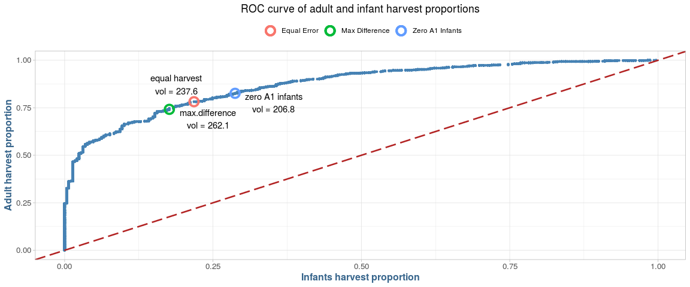<!-- -->

### b.) Numerical Area

+ Numerically integrating the area under the ROC curve and reporting our result. This is most easily done with the *auc()* function from the "flux" package. 
+ Areas-under-curve, or AUCs, greater than 0.8 are taken to indicate good discrimination potential. 

_(AUC-ROC curve)_. When we need to evaluate/visualize the performance of the multi-class classification problem, we use AUC (Area Under The Curve) and ROC (Receiver Operating Characteristics) curve. ROC is a probability curve and AUC represents the degree of separability. It tells how much the model is capable of distinguishing between classes such as harvest/not-harvest. The higher the AUC, the better the model is at predicting Adults as harvest and Infants as not-harvest. A highly accurate model has AUC close to 1 which reflects it's good measure of separability. A poor model has AUC near 0 which means it has worst measure of separability.


------------------
 Area Under Curve 
------------------
      0.8667      
------------------

-----

## 10.) __Results__

### a.) Consolidated

Preparing a table showing each cutoff along with the following:

+ 1.) __True Positive__ rate (1-prop.adults,
+ 2.) __False Positive__ rate (1-prop.infants),
+ 3.) Harvest proportion of the __total population__
 	
<table class="table table-striped table-hover" style="margin-left: auto; margin-right: auto;">
<caption>Consolidated Harvest Proportions</caption>
 <thead>
  <tr>
   <th style="text-align:left;"> Type </th>
   <th style="text-align:right;"> Volume </th>
   <th style="text-align:right;"> TPR </th>
   <th style="text-align:right;"> FPR </th>
   <th style="text-align:right;"> Yield </th>
  </tr>
 </thead>
<tbody>
  <tr>
   <td style="text-align:left;"> max.difference </td>
   <td style="text-align:right;"> 262.143 </td>
   <td style="text-align:right;"> 0.742 </td>
   <td style="text-align:right;"> 0.176 </td>
   <td style="text-align:right;"> 0.584 </td>
  </tr>
  <tr>
   <td style="text-align:left;"> zero.A1.infants </td>
   <td style="text-align:right;"> 206.786 </td>
   <td style="text-align:right;"> 0.826 </td>
   <td style="text-align:right;"> 0.287 </td>
   <td style="text-align:right;"> 0.676 </td>
  </tr>
  <tr>
   <td style="text-align:left;"> equal.error </td>
   <td style="text-align:right;"> 237.639 </td>
   <td style="text-align:right;"> 0.782 </td>
   <td style="text-align:right;"> 0.218 </td>
   <td style="text-align:right;"> 0.625 </td>
  </tr>
</tbody>
</table>
 	
__Question:__

Based on the ROC curve, it is evident that a wide range of possible "cutoffs" exist. 
Compare and discuss the 3 cutoffs determined in this task.  

__Answer:__

>The 3 various cutoffs represent distinct characteristics of a given harvest of abalone. The max difference method which is essentially the brute force solution here, I believe represents arguably the worst-case scenario. The true-positive rate is the lowest of the 3, as well as the lowest overall harvest yield ratio. Although, this method does have the lowest false-positive rate as well.
<br/><br/>
The Zero A1 Infants harvest has the benefit of having the highest true-positive harvest rate and overall harvest yield. The drawback here is that this method also leads to the highest rate of false-positives, meaning more Infants will ultimately get harvested which is not ideal for future harvest and sustainability.
<br/><br/>
The equal error methodology is, as the name implies, right down the middle in terms of true-positive rate, false-positive rate, and overall harvest yield, essentially splitting max on the low end and Zero A1 on the high end (in terms of error).


-----

__Question:__ 

Assuming we are expected to make a presentation of our analysis to the researchers, how would we do so?  
Considering the following in our response:

1. Would we make a specific recommendation or outline various choices and trade-offs?
2. What qualifications/limitations would we present regarding our analysis?
3. If it is necessary to proceed based on the current analysis, what suggestions would we have for implementation of a cutoff? 
4. What suggestions would we have for planning future abalone studies of this type? 

__Answer:__

Given that there is no clear harvesting strategy that has 'best fit' for all use cases involved (harvest yield, protection of Infants, and minimization of false-positives, _coupled with the fact that I are not an expert on abalone harvesting_, I would not recommend any single strategy but rather simply present the findings above and present the various trade-offs, each technique present and let the experts decide.

The qualifications here are that this is an observational study on which I had no control over the sample gathered, therefore causality cannot be firmly established if I cannot control the variables under study. This must be understood before applying techniques discovered through this analysis.

As previously noted, I are no expert in the field of __abalone harvesting,__ however, if forced to pick a method from the data observed and the analysis performed, I would recommend the Zero A1 Infants, as it has the highest proportion of harvest yield by volume and the highest true-positive rate, while still protecting the most important segment of the population which are A1 Infant abalone. 

This will ensure that further harvest will be sustainable by leaving the Infants to mature into Adults. The high false-positive rate is indeed an area of concern, however, I believe this proportion could be misleading given the general difficulty in determining abalone Sex, and that the Infants that are harvested will be of justifiable size.

__I would recommend that the executors of supplemental research in this area be consulted in advance of sample collection so that they may properly plan to have a control group in the study. I would also suggest that the researchers be advised by experts in this area in that planning phase on potential downfalls in sample collection and control group selection, so that we can minimize confounding factors in our research and conduct it with greater confidence than a simple observational study alone__.
